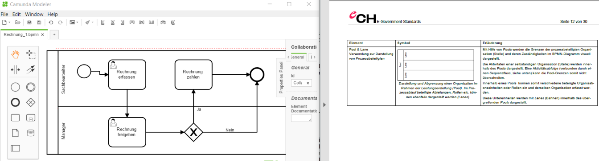
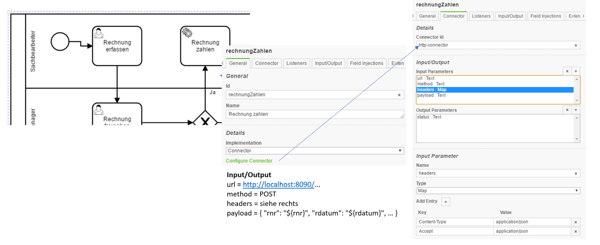

# bpmn-tutorial

Das nachfolgende BPMN Tutorial basiert auf dem Blog Eintrag [Use Camunda without touching Java and get an easy-to-use REST-based orchestration and workflow engine](https://blog.bernd-ruecker.com/use-camunda-without-touching-java-and-get-an-easy-to-use-rest-based-orchestration-and-workflow-7bdf25ac198e) von Bernd Rücker.

## Installation

Es wird folgende Software benötigt:

* Java
* [Camunda Modeler](https://camunda.org/download/modeler/)
* [BPM platform - Tomcat Distribution](https://camunda.org/download/)

Und folgende Unterlagen:

* [eCH-0074: Geschäftsprozesse grafisch darstellen - Der Einsatz von BPMN aus Geschäftssicht](https://www.ech.ch/vechweb/page?p=dossier&documentNumber=eCH-0074)

## Schritt 1 - Modellieren des Prozesses

Camunda Modeler und eCH-0074 Prozess nebeneinnander öffnen.

Im Camunda Modeler
   * Create Pool/Participant.
   * Pool anklicken und rechts die Properties wie folgt setzen: Process Id = Rechnung und Executable aktiveren.
   * Pool in zwei Lanes (rechts neben Pool) teilen.
   * Doppelklick auf obere Lane und mit "Sachbearbeiter" bezeichnen, Doppelklick auf unterne Lane und mit "Manager" bezeichnen.
   * Create Task und mittels "Schraubenschlüssel" Task auf Typ "User Task" ändern und mittels Doppelklick Task mit "Rechnung erfassen" bezeichen.
   * Rechts Properties im Tab Forms wie folgt setzen: Form Type = Form Data und drei Felder: Rechnungs-Nr, -Datum und -Betrag erstellen.
   * Neue Task in der Lane "Manager" erstellen, mit "Rechnung freigeben" bezeichnen und Form Data mit Feld "freigegeben" als Boolean eintragen.
   * Create ExclusiveGateway erstellen.
   * Task "Rechnung zahlen" in Lane "Sachbearbeiter" erstellen.
   * End Event erstelen.
   * Zum Schluss die Elemente, wie im Bild, mit Pfeilen verbinden.
   * Linie von ExclusiveGateway nach "Rechnung zahlen" mit Ja und als "Condition Type" = Expression mit Wert `${freigegeben}` 
   * Linie von ExclusiveGateway nach End Event mit Nein und als "Condition Type" = Expression mit Wert `${!freigegeben}` erfassen.
   * Bei allen Tasks auf dem General Properties Tab: Assigne = demo eintragen.
   
BPMN Prozess als Rechnung.bpmn speichern.
 
## Schritt 2 - Prozess veröffentlichen und ausführen

[BPM platform - Tomcat Distribution](https://camunda.org/download/) downloaden und starten.

Es wird automatisch ein Browser geöffnet. Anmelden mittels demo/demo.

BPMN Prozess mittels [REST](https://de.wikipedia.org/wiki/Representational_State_Transfer) bzw. `curl` veröffentlichen:
	
	curl -w "\n" \
	-H "Accept: application/json" \
	-F "deployment-name=rechnung" \
	-F "enable-duplicate-filtering=true" \
	-F "deploy-changed-only=true" \
	-F "Rechnung.bpmn=@Rechnung.bpmn" \
	http://localhost:8080/engine-rest/deployment/create

Beim Parameter hinter @ handelt es sich um einen Dateinamen, welche ggf. anzupassen ist.

Auf "Tasklist" (rechts oben) wechseln und mittels "Start process" den Rechnung Prozess starten. Beim User Demo sollte unter "My Tasks" die Task "Rechnung erfassen" erscheinen.

## Schritt 3 - Prozess mittels Service Task und REST automatisieren

Im nächsten Schritt wird die User Task "Rechnung zahlen" durch eine Service Task mit REST Aufruf automatisiert.

Dazu brauchen wir ein Backend, z.B. in [NodeJS](https://nodejs.org/en/), siehe Beispiel [mainStep3.js](mainStep3.js).

Anschliessend ist der BPM Prozess, wie oben, zu erweitern.

Im Camunda Modeler
* Task "Rechnung zahlen" mittels "Schraubenschlüssel" auf Service Task ändern.
* Implementation auf Connector ändern
* Auf dem Connector Tab: Connector Id: `http-connector`, Input/Output Felder
	* `url` = URL Backend
	* `method` = HTTP Methode, hier POST
	* `headers` = HTTP Header insbesondere das Format `application/json` eintragen
	* `payload` = Die zu übertragende Felder im JSON Format: `{ "rnr": "${rnr}", "rdatum": "${rdatum}", "rbetrag": "${rbetrag}" }`
eintragen und via `curl` veröffentlichen.

[mainStep3.js](mainStep3.js) starten und Prozess in [BPM platform](https://camunda.org/download/) ausführen.

Ein angepasster BPM Prozess ist in [RechnungStep3.bpmn](RechnungStep3.bpmn) zu finden.

   
   
   
